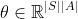
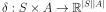
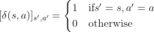
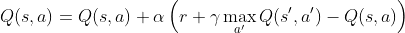
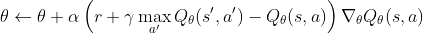
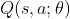

# DQN

## Overview

This project is a paper replication of DeepMind's DQN paper [[Human-level control through deep reinforcement
learning](https://storage.googleapis.com/deepmind-media/dqn/DQNNaturePaper.pdf)] agent as well as an attempt to implement Q-Learning algorithms for reinforcement learning using OpenAI Gym environments. 

## Methods

When state spaces are large or continuous and it becomes infeasible to store the values of [Q function for each (state, action)](https://towardsdatascience.com/a-beginners-guide-to-q-learning-c3e2a30a653c) pair in a table 
we can scale its representation across states is by learning a set of parameters that allows it to be generalized across states.

First we try to represent Q as a linear function of states and actions. \
Then we approximate it with a deep neural network described in DeepMind's Nature paper of the Atari playing agent.
### Linear Approximation to Q-Function
Suppose we represent the Q-function as:

=\theta^\top\delta(s,a)) (equation 1)

where  and  \
with: 


#### Update Rule for 

The update rule for  
can be derived by using the linear approximation in the Q-learning update rule. \
The tabular Q-learning update rule is: \
 \
And since we chose a linear approximation (equation 1) for Q function =\delta(s,a)), this translates to: \


In the tabular case, the Q-values are directly updated for each state-action pair. In the linear approximation, the Q-values are represented as a linear combination of features, and the parameter vector \( \theta \) is updated in the direction that minimizes the temporal difference error. This ensures that the Q-values estimated by the linear function approximation move closer to the true Q-values, similar to the tabular case.

### Deep Q-Network
Deep Q-Networks (DQNs) extend the Q-learning algorithm by using deep neural networks to approximate the Q-value function. This allows DQNs to handle high-dimensional state spaces, such as those found in visual data (e.g., images from video games), which would be infeasible with tabular Q-learning or linear approximations.

The key ideas behind DQNs include:
1. **Function Approximation with Neural Networks** \

2. **Experience replay** \
To stabilize training, DQNs use a replay buffer to store transitions 
(s,a,r,s′) during gameplay. Mini-batches of experiences are randomly sampled from this buffer to break the correlation between consecutive samples and to smooth out learning updates.
3. **Target Network** \
To address the instability caused by the moving target problem (i.e., the target values for Q-learning constantly changing), DQNs use a separate target network to generate target Q-values. The target network's weights are updated less frequently than the main network, providing a stable target for learning.
 \
[implementation](https://github.com/katesolonko/DQN/blob/main/q_learning/network/dqn.py)

## Installation

### Prerequisites

- Python 3.8+
- Conda (recommended for environment management)

### Step-by-Step Installation

1. **Clone the Repository**

    ```sh
    git clone https://github.com/yourusername/dqn
    cd dqn
    ```

2. **Set Up the Conda Environment**

    Create a new conda environment using the provided `environment.yml` file:

    ```sh
    conda env create -f environment.yml
    conda activate rl_env
    ```

3. **Install the Package**

    Install the package in editable mode:

    ```sh
    pip install -e .
    ```

4. **Import Atari ROMs**

    Download the Atari ROMs and import them:

    ```sh
    pip install gym[accept-rom-license]
    ale-import-roms path/to/your/atari_roms
    ```

## Usage
```sh
python main.py --config_filename config.yml
```

### Configuration

The configuration for the project is managed using a YAML file. Below is an example configuration (`config.yml`):

```yaml
model: "dqn"
env:
  env_name: "ALE/Pong-v5"
  render_mode: "human"
output:
  output_path: "results/"
  log_path: "results/log.txt"
  plot_output: "results/scores.png"
model_training:
  num_episodes_test: 20
  grad_clip: True
  clip_val: 10
  saving_freq: 5000
  log_freq: 50
  eval_freq: 1000
  soft_epsilon: 0
  device: "cpu"  # cpu/gpu
  compile: False
  compile_mode: "default"
hyper_params:
  nsteps_train: 10000
  batch_size: 32
  buffer_size: 1000
  target_update_freq: 500
  gamma: 0.99
  learning_freq: 4
  state_history: 4
  lr_begin: 0.005
  lr_end: 0.001
  lr_nsteps: 5000
  eps_begin: 1
  eps_end: 0.01
  eps_nsteps: 5000
  learning_start: 200
